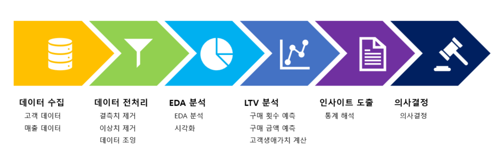
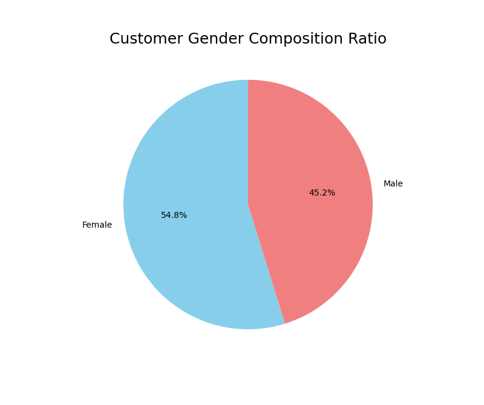
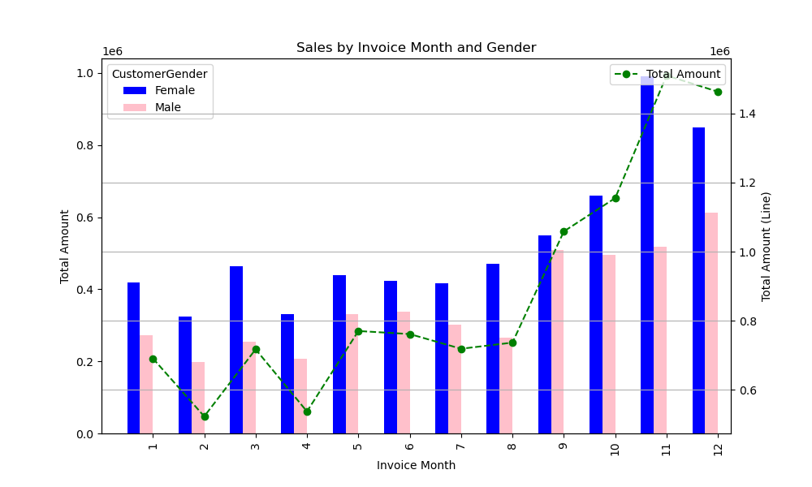
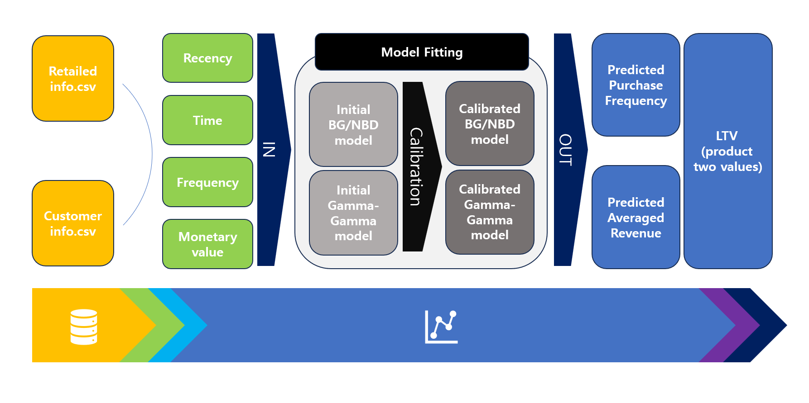
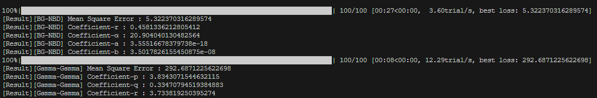
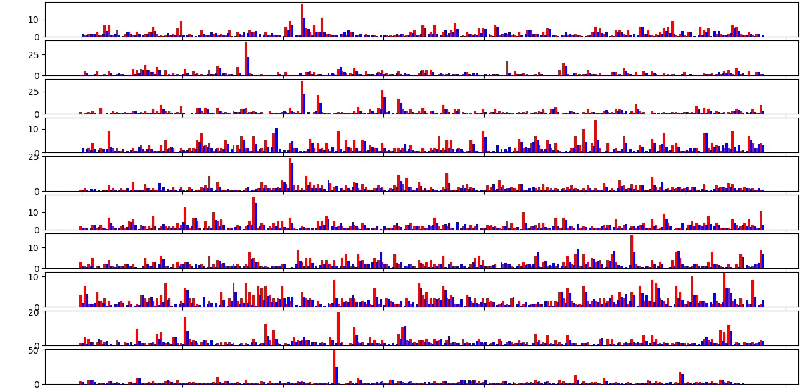
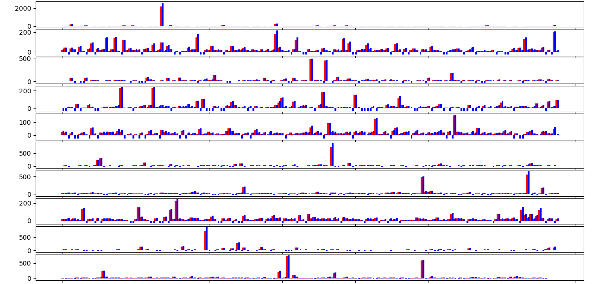

# Post1 : 고객생애가치 분석  
최초 작성일 : 2023-12-10  
마지막 수정일 : 2023-12-12
  
## 0. Overview
판매 내역 데이터와 고객 데이터를 활용하여, EDA분석 및 LTV분석을 한 파이썬 파일을 설명하는 글이다. 

## Table of Contents
1. [Introduction](#1.-Introduction)
2. [Dataset](#2.-Dataset)
3. [EDA Analysis(Data visualization)](#3.-EDA-Analysis-data-visualization) 
4. [LTV Analysis](#4.-LTV-Analysis)
5. [Reference](#5.-Reference)

## 1. Introduction 

고객생애가치 LTV는 'Life-Time Value'의 줄임말로, 고객이 평생 동안 기업에게 어느 정도의 금전적 가치를 가져다 주는지를 정량화한 지표를 의미한다. LTV 지표는 유료 웹 서비스를 제공하는 업체나 카드 회사, 게임 회사에서 많이 사용되어 왔으나, 최근 많은 시장(거래)가 전산화가 되고 있기 때문에 더욱 많은 기업에서 마케팅 지표로 활용되고 있다. 지표는 (예상 구매 횟수) X (예상 평균 수익)으로 계산되며, (예상 구매 횟수)는 BG/NBD(Beta, Geometic / Negative Binomial) 모형을 따르고, 예상 평균 수익은 Gamma-Gamma 모형에 의해 산출됩니다. 이를 위해, R (Recency), F (Frequency), T (Time), M (Monetary Value)의 정보가 요구된다. 이를 위해 다음과 같은 순서로 분석을 수행하였다.

## 2. Dataset
분석을 위해 활용한 데이터는 2개의 csv파일로 이루어져 있으며, 고객(회원정보)가 포함되어 있는 'Customer info.csv'파일은 '541910 X 7'의 크기로 다음과 같은 컬럼을 갖는다.
|Name|Type|Description|
|:--:|:--:|:--:|
|CustomerID|String|고객 ID|
|CustomerName|String|고객 이름|
|CustomerAge|Integer|고객 나이|
|CustomerGender|String|고객 성별|
|CustomerPhoneNumber|String|고객 전화번호|
|CustomerEmail|String|고객 이메일|
|CustomerAddress|String|고객 주소|

이 때, '고객 전화번호', '고객 이메일', '고객 주소'은 faker 라이브러리를 이용하여 생성한 가상의 정보이다. 또, 판매 내역 정보가 포함되어 있는 'Retailed info.csv' 파일은 '1070 X 7'의 크기로 다음과 같은 컬럼을 갖는다.
|Name|Type|Description|
|:--:|:--:|:--:|
|InvoiceNo|Integer|송장 번호|
|StockCode|String|제품 코드|
|Description|String|제품명|
|Quantity|Integer|구매 수량|
|InvoiceDate|Datetime|구매 일자, 시각|
|UnitPrice|Float|제품 단가|
|CustomerID|String|고객 ID|

두 데이터는 '고객 ID(CustomerID)'를 공통 컬럼으로 갖고 있기 때문에, 해당 컬럼을 통해 두 데이터를 조인(join)할 수 있다.
## 3. EDA Analysis(Data visualization)
판매 내역 데이터와 고객 데이터를 결합한 뒤, 판매 내역과 고객의 연령, 성별, 그리고 시간 정보 간의 상관관계를 조사하였다. 

원 그래프(Customer Gender Composition Ratio)는 고객을 성별로 그룹화하여 두 그룹을 비교한 것으로, 성별의
고객 비율을 나타낸다. 여성 고객이 남성 고객에 비해 약 10% 더 많은 것을 확인 할 수 있다. 

하지만, 원 그래프(Total Sales by Customer Gender)로부터 총 매출 면에서는 여성 고객과 남성 고객은 약 20% 차이가 나는 것을 확인 할 수 있다. 이를 통해, 여성 고객이 남성 고객보다 평균 매출(=제품 단가 X 구매 수량)이 더 높다는 것을 알 수 있다. 

전체 고객의 나이 별로 그룹화하여, 총 매출을 비교한 것으로, 푸른색 막대 그래프는 해당 나이대의 여성의 매출 총합, 붉은색 막대 그래프는 해당 나이대의 남성의 매출 총합을 나타내며, 초록색 꺾은 선그래프는 해당 나이대의 매출의 총합을 나타낸다. 양쪽 y축은 모두 총 매출(Total Amount)을 나타내며, 왼쪽 y축과 오른쪽 y축은 각각 막대 그래프와 꺾은 선 그래프의 수준을 나타낸다.

40대의 경우 남녀 간 매출이 비슷한 수준을 보이지만, 다른 나이대에서는 여성 고객의 매출 총합이 높은 것으로 나타난다. 특히, 30대에서 50대, 20대, 40대, 그리고 10대 순으로 매출 총합이 크며, 30대의 경우 압도적으로 높은 매출을 기록하고 있다. 

판매 일자를 월별로 그룹화하여 총 매출을 비교한 결과이다. 푸른색 막대 그래프는 해당 월의 여성 고객 매출 총합을, 붉은색 막대 그래프는 해당 월의 남성 고객 매출 총합을 나타낸다. 또한, 초록색 꺾은선 그래프는 해당 월의 전체 매출 총합을 표현하고 있다. 양쪽 y축은 모두 총 매출(Total Amount)을 나타내며, 왼쪽 y축과 오른쪽 y축은 각각 막대 그래프와 꺾은 선 그래프의 수준을 나타낸다.

모든 시간대에서 여성 고객이 매출 총합이 높은 것으로 나타난다. 특히, 3월, 8월, 12월에 큰 차이가 관측되며, 11월에는 여성 고객의 매출 총합이 남성 고객의 매출 총합보다 약 2배 수준으로 기록되었다. 또한, 연말에는 매출이 증가하는 경향이 있는 것으로 관찰된다

## 4. LTV Analysis
LTV를 분석하기 위해 다음과 같은 단계를 따른다.

1. 지표(R, T, F, M) 산출
2. 모델 BG/NBD, Gamma-Gamma 모델 모수 추정
3. 예상 구매 횟수, 예상 평균 수익, 고객 생애 가치 계산
4. 두 값을 곱하여 고객 생애 가치 계산

위 단계를 도식화 하면 다음과 같다.

### 4-1. 지표(R, T, F, M) 산출

LTV를 분석하기 위해서는 입력 데이터 중 3가지 데이터 거래 일자, 거래 금액, 고객 ID(고객 구분자)를 이용하여 확률 모델의 입력 값은 다음 4가지 F, R, T, M 지표를 산출한다. 예를 들어, 입력 데이터가 'df'의 이름의 DataFrame이며, 거래 일자, 거래 금액, 고객 ID를 나타내는 컬럼이 각각 'Date', 'ID', 'Sale', 그리고 분석 하는 당일(집계일)을 'base_date'이라 가정하면 아래와 같이 지표를 정리할 수 있다.

|Symbol|Description|DataFrame Code|
|------|---|---|
|F|**Frequency** : Total purchase count excluding the initial one|len(df['Date'].unique()) - 1|
|R|**Recency** : Duration from the first purchase date to the last one (in days)|max(df['Date']) - min(df['Date'])|recency|
|T|**Time** : Duration from the first purchase date to the aggregation date (in days)|base_date - min(df['Date'])
|M|**Monetary Value** : Total purchase amoun|df.groupby('date')['Sale'].sum()|

### 4-2. 모델 BG/NBD, Gamma-Gamma 모델 모수 추정
BG/NBD 모델과 Gamma-Gamma 모델에 L2-penalty를 적용하여, 모델을 피팅하는 단계이다. 이 때, L2-penalty는 정규화(Regularization) 기법을 의미하며, 모델의 가중치에 대한 제약 조건을 추가하여 모델의 불안정성과 과적합(Overfitting)을 방지하기 위해 활용된다. 정규화 기법을 적용하기 위해서는 기존 비용 함수 $E_{old}$에 'penalty term'을 더해 새로운 비용 함수 $E_{new}$를 정의 해야 하고, 'penalty term'을 정의할 때 사용하는 norm이 $L^2$-norm일 경우, 이 penalty를 L2-penalty라고 한다.
$$E_{new} = E_{old} + \lambda \sum_{i \leq n}{\omega_{i}^{2}}$$

모수 추정(Calibration)은 주어진 데이터의 분포를 가장 잘 설명하는 적절한 모수를 찾는 것을 의미한다. 따라서, 관측 데이터와 모델의 의한 수치와의 오차를 계산한 함수의 정의가 필요하다. 본 분석에서 사용한 오차는 평균 제곱 오차(MSE, Mean-Sqaure Error)이다.

$$MSE =\frac{1}{n} \sum_{i \leq n}{(y_{i} - \hat{y}_{i})^2}$$

BG/NBD 모델의 모수를 추정할 때, 모델 모수는 실제 frequency와 모델 frequency와 간의 차이를 최소화하는 방식으로 유도된다. 만약 평균 제곱 오차(MSE)가 오차 계산 함수로 선택된 경우, 모델 모수는 다음 방정식을 사용하여 추정된다.

$$(\hat{r}, \hat{\alpha}, \hat{a}, \hat{b})$$

$$\argmin_{(r, \alpha, a, b)}\sum_{i \leq n}{(\mathcal{F}^{\text{actual}}_{i} - \mathcal{F}^{\text{model}}_{i}(r, \alpha, a, b))^{2}}$$

또,같은 방법으로, Gamma-Gamma 모델의 모수를 추정할 때, 모델 모수는 실제 monetary value 모델에 의해 계산 되는 monetary value와 간의 차이를 최소화하는 방식으로 유도된다. 따라서, 다음 방정식을 얻는다.

$$(\hat{p}, \hat{q}, \hat{r}) = \argmin_{(p, q, r)}\sum_{i \leq n}{(\mathcal{M}^{\text{actual}}_{i} - \mathcal{M}^{\text{model}}_{i}(p, q, r))^2}$$

함수를 실행하면, BG-NBD모델과 Gamma-Gamma모델은 주어진 데이터를 통해 모수를 추정하게 되고, 소요 시간은 각각 27초와 8초로 측정이 되었으며, 오차는 약 5.322와 292.687이다.

BG/NBD 모델의 가정에 따르면, 추정된 모수는 다음과 같은 의미를 갖는다.

1. 구매율(단위 시간당 구매 횟수), $\lambda$는 감마 분포를 따른다.
$$\lambda \sim \text{Gamma}(r, \alpha) $$

2. 일정 기간 $T$일(days) 동안 구매 횟수, $N$는 포아송 분포을 따른다.
$$N_{\lambda} \sim \text{Pois}(\lambda T)$$

3. 이탈률(더 이상 구매를 하지 않을 확률), $p$는 베타 분포를 따른다.
$$p \sim \text{Beta}(a, b)$$

4. 이탈까지의 구매 횟수, $M$은 기하 분포를 따른다.
$$M_{p} \sim \text{Geo}(p)$$

이 때, 집계일 이후 1년 동안의 예측을 시도하였기 때문에, $T = 365$이다.

### 4-3. 예상 구매 횟수, 예상 평균 수익, 고객 생애 가치 계산
마지막으로, 추정된 모수를 통해 예상 구매 횟수, 예상 평균 수익, 고객 생애 가치(LTV)를 계산한 결과는 아래 화면과 같다. 고객 생애 가치('life_time_value')을 기준으로 내림차순으로 출력하였기 때문에 가장 기대 가치가 높은 고객은 'User42159'라 판단할 수 있다.

### 4-4. 정확도 검증
모수를 추정하는 단계에서 구매 일수의 평균 제곱 오차는 $5.322$일만큼, 평균 구매 금액의 평균 제곱 오차는 $292.687$만큼 발생하였다. 이를 시각화 하여, 모델이 어느 정도 정확도를 갖는지 확인해보자.

먼저 BG/NBD 모델에 의해 계산된 평균 구매 금액과 실제 평균 구매 금액실제 평균 구매 금액을 나타낸 막대 그래프이다. 두 수준을 비교하기 위해 두 막대를 이웃되게 배치하고, 고객 목록을 나열하여 170명씩 그룹으로 나누어 총 10개의 subplot을 생성하여 그래프로 표현하였다. 총 고객 수는 1697명이며, 이를 가독성을 높이기 위해 170명씩 10개의 그룹으로 분할하였다. 해당 그래프를 통해 모델의 평균 구매 금액이 실제 평균 구매 금액을 잘 반영하고 있음을 확인할 수 있다.

Gamma-Gamma 모델에 의해 계산된 구매 일수과 실제 구매 일수실제 평균 구매 금액을 나타낸 막대 그래프이다. 레이아웃은 BG/NBD 모델의 경우와 동일하며, 이 경우에도 모델은 구매 일수를 잘 반영하고 있음을 확인할 수 있다.

## 5. List of Objects 
아래에서는 분석에 사용된 함수를 나열해 놓았다.
|Name|Type|Desription|
|------|---|---|
|BetaGeoFitter|Imported|penalty를 이용하여 BG-NBD 모델 피팅|
|GammaGammaFitter|Imported|penalty를 이용하여 Gamma-Gamma 모델 피팅|
|calibration_and_holdout_data|Imported|입력 데이터를 훈련셋과 테스트셋으로 나눠 지표(R, F, M, T) 계산|
|summary_data_from_transaction_data|Imported|입력 데이터로부터 지표(R, F, M, T) 계산|
|score_model|User-defined|추정된 값과 실제 값 간의 오차 계산|
|find_L2penalty_BG_NBD_model|User-defined|BG/NBD 모델을 목적 함수로 하여 최적의 L2 penalty를 계산|
|evaluate_BG_NBD_model|User-defined|모델에 의한 frequency를 계산하여, 오차를 계산|
|calibrate_BG_NBD_model|User-defined|BG/NBD의 모수 추정에 대한 전체 프로세스를 실행|
|find_L2penalty_Gamma_Gamma_model|User-defined|Gamma-Gamma 모델을 목적 함수로 하여 최적의 L2 penalty를 계산|
|evaluate_Gamma_Gamma_model|User-defined|모델에 의한 monetary value를 계산하여, 오차를 계산|
|calibrate_Gamma_Gamma_model|User-defined|Gamma-Gamma의 모수 추정에 대한 전체 프로세스를 실행|

## 6. Reference
[1] Fader, P. S., Hardie, B. G., & Lee, K. L. (2005). “Counting your customers” the easy way: An alternative to the Pareto/NBD model. Marketing science, 24(2), 275-284.  
[2] 이은지 (2022). LTV (Life Time Value) 지표 속 BG/NBD 모델과 Gamma-Gamma 모델 파헤치기. [출처 : https://assaeunji.github.io/statistics/2022-04-15-ltv/]  
